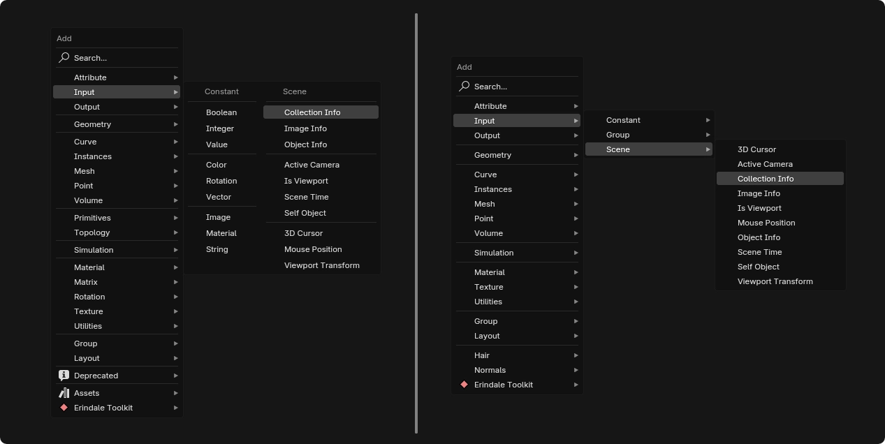
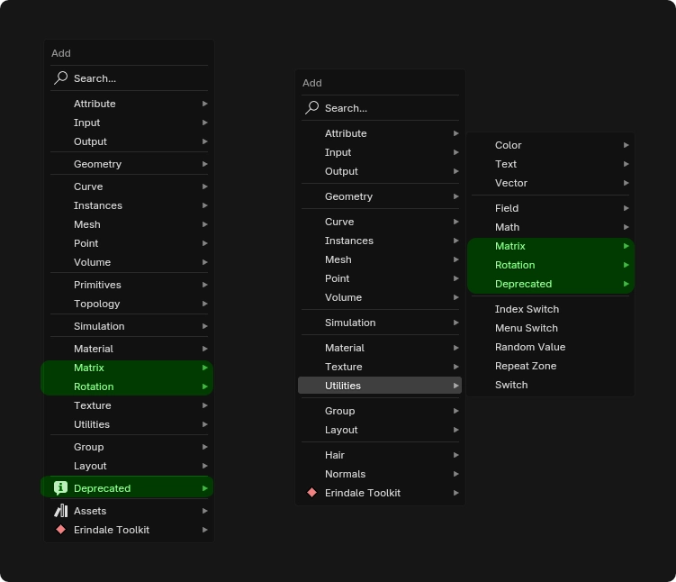
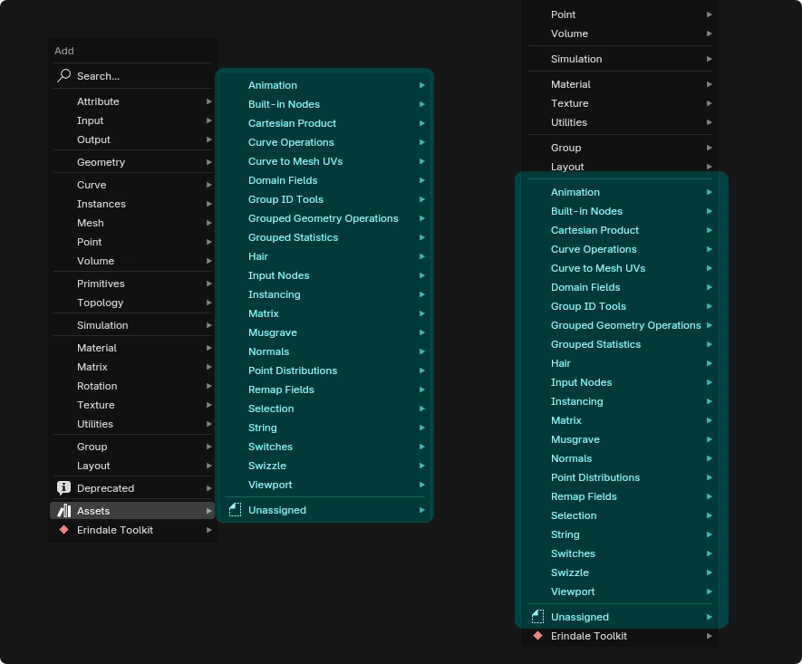
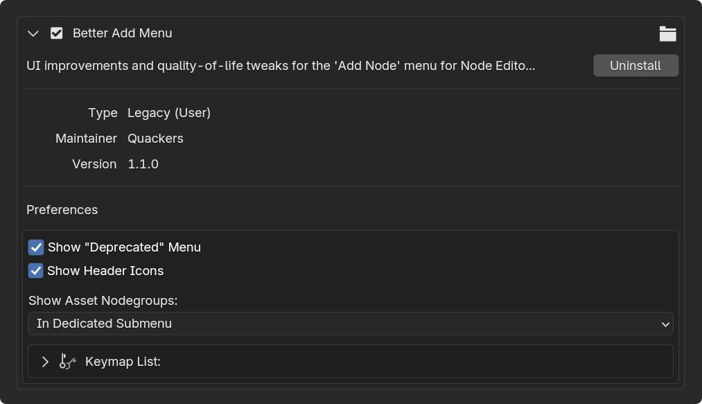
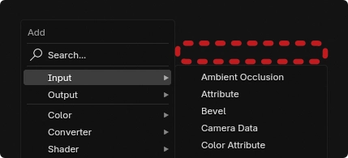
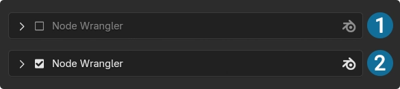
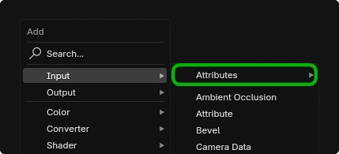
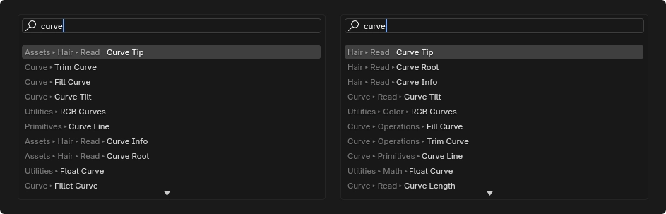

# Better Add Menu

UI improvements and quality-of-life tweaks for the 'Add Node' menu in Blender's Node Editor.

<u>Supported Versions:</u> *Blender 4.0 to 4.5*

---

## Features

#### - No More Nested Submenus

To minimize the amount of time it takes to get to the nodes you want, nested submenus are flattened into a single menu with the different categories appearing as different columns.

This helps reduce [*"snaking"*](https://x.com/quackarooners/status/1823388484591341780) , where each level of a nested menu opens in a different direction, leading to an inconsistent user experience.

#### - More Easily Accessible Categories

Categories such as "Matrix", "Rotation", and "Deprecated" are pulled out of the "Utilities" submenu and are transferred to the top-level for easier access.

#### - Separators & Groupings

Other menus such as "Rotation" in Geometry Nodes, or "Blur" in the Compositor, among others, have extra separators added, allowing for grouping similar nodes with each other, while still maintaining alphabetical order.

#### - Asset Menu

Catalogs for nodegroup assets are now placed on a dedicated "Assets" menu. This helps reduce vertical clutter caused by large asset libraries. 

Additionally, it can be called separately via a hotkey that's user-configurable.

---

## Preferences

- `Show Deprecated Menu` - Toggles visibility of the *"Deprecated"* menu, which contains nodes that are intended to be phased out of use.

- `Show Header Icons` - Toggle icons for header labels of submenus.

- `Show Asset Nodegroups` - Toggles visibility of the *"Assets"* menu, which contains nodegroup assets from the user's asset library.

#### Keymap List:

> `Add Asset Nodegroup` - Calls *"Assets"* as a standalone menu.

---

## Known Limitations/Behaviors

#### - Compatibility with Other Addons

Certain addons, such as Node Wrangler, may attach elements to Blender's built-in Add Menu. Since this addon replaces the Add Menu, those elements might not transfer over correctly if they were attached before this addon was loaded. 

As far as I am aware, the Blender API currently doesn't provide any tools for addon developers to address this issue. 

The only way I can suggest to remedy this is to disable, and then re-enable any addons whose UI elements are not appearing in the Add Menu. This places them last in the addon loading order, so Better Add Menu's code gets loaded first and their UI elements should now get attached correctly.

After you do this once, the loading order should stay consistent across sessions, so you won't need to do this every time you use Blender. Provided you don't disable Better Add Menu, that is. As in that case, Better Add Menu gets pushed back in the loading order, and you'll have to repeat this procedure again.

#### - Difference in Search Results

The search results for the built-in Add Menu show the whole chain of categories a node is parented to. 

Since this addon flattened all the nested menus, this makes it so the search results are different as they only list the main category they belong to, and not any of the subcategories. 

This isn't significantly impactful to the search functionality, and some might even see this as a feature, as there's less clutter in the search results. Regardless, it's simply worth pointing out there is technically a difference in behavior in this regard.

---

## Changelog

## v1.1.0

- Added icons for submenu headers. *(Can be disabled via preferences)*

- Add user preference for controlling how asset nodegroups are displayed.
